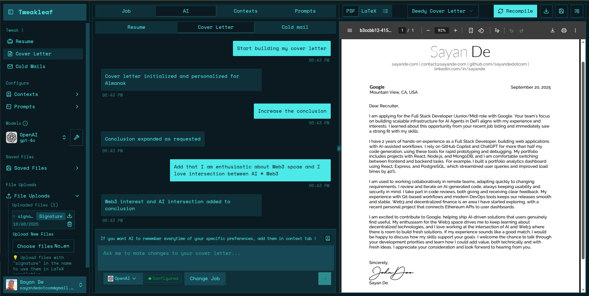

<p align="center">
  
</p>

<h1 align="center">Tweakleaf</h1>

<p align="center">
  <strong>Tweak your LaTeX resumes and cover letters with AI Agents!</strong>
</p>

<p align="center">
  Apply to 100+ jobs in just 10 minutes for free with AI that creates or tweaks cover letters and resumes optimized with accurate keywords and humanized content to avoid ATS AI detection and improve your document rankings.
</p>

<p align="center">
  <a href="https://tweakleaf.com">🌐 Website</a> •
  <a href="#features">✨ Features</a> •
  <a href="#comparison">⚡ Why Choose Us</a> •
  <a href="#getting-started">🚀 Getting Started</a>
</p>

---

## 🎯 What is Tweakleaf?

Tweakleaf is an AI-powered platform that revolutionizes job applications by automatically generating and optimizing LaTeX resumes and cover letters. Our advanced AI agents use multiple LLM models with sophisticated context engineering to create unique, ATS-optimized documents that are indistinguishable from human-written content.

### Key Benefits

- **⚡ Lightning Fast**: Generate documents in ~10 seconds
- **🎯 ATS Optimized**: Superior compatibility with Applicant Tracking Systems
- **🤖 AI-Powered**: Multiple LLM models with advanced context engineering
- **💾 Long-term Memory**: AI learns your preferences across all interactions
- **💰 Cost-Effective**: Only $0.50 per 100 documents
- **📝 LaTeX Support**: Professional document formatting

## ✨ Features

| Feature                 | Description                                                              |
| ----------------------- | ------------------------------------------------------------------------ |
| **⚡ Speed**            | Generate resume/cover letter in ~10 seconds from job description         |
| **📝 LaTeX Support**    | Professional LaTeX formatting for superior ATS compatibility             |
| **🤖 Humanized Text**   | Content indistinguishable from human-written text                        |
| **🎯 ATS Optimization** | AI designed specifically for ATS awareness and high rankings             |
| **🔄 Multiple Models**  | Support for OpenAI, Anthropic, Gemini, DeepSeek, and Hugging Face models |
| **💰 Low Cost**         | Platform is free - you only pay for API usage ($0.50 per 100 documents)  |
| **📚 Expert Prompts**   | Proven prompts from experts for high ATS rankings                        |
| **🧠 Long-term Memory** | AI remembers your context and preferences across all interactions        |

## ⚡ Why Choose Tweakleaf?

| Aspect                   | AI Chat Models (ChatGPT, etc.)                                 | **Tweakleaf**                                                 |
| ------------------------ | -------------------------------------------------------------- | ------------------------------------------------------------- |
| **⏱️ Time**              | Copy-paste from chat every time - inefficient & time-consuming | Generate and download documents in ~10 seconds                |
| **📝 Prompts**           | Your prompts may not be ATS-optimized                          | Expert-curated prompts proven for high ATS rankings           |
| **📄 LaTeX Support**     | No LaTeX support - manual copy-paste required                  | Built-in LaTeX editor & compiler with professional formatting |
| **🎯 ATS Compatibility** | Not ATS-aware                                                  | AI specifically designed for ATS optimization                 |
| **🔍 AI Detection**      | Fails ATS AI detection mechanisms                              | Humanized content that passes AI detection                    |
| **🧠 Memory**            | Forgets context after 6-7 messages                             | Advanced AI agent with long-term memory                       |
| **💸 Cost**              | $20+/month for quality models                                  | Only $0.50 per 100 documents                                  |
| **🔄 Model Variety**     | Switch between different websites                              | All models in one platform                                    |
| **📚 Context**           | Short-term memory only                                         | Continuous learning from user context                         |

## 🚀 Getting Started

### Prerequisites

- Node.js 18+
- pnpm (recommended) or npm
- API keys for your preferred LLM models

### Installation

1. **Clone the repository**

   ```bash
   git clone https://github.com/tweakleaf/tweakleaf.git
   cd tweakleaf
   ```

2. **Install dependencies**

   ```bash
   pnpm install
   ```

3. **Set up environment variables**

   ```bash
   cp .env.example .env.local
   # Add your API keys to .env.local
   ```

4. **Start the development server**

   ```bash
   pnpm dev
   ```

5. **Open your browser**
   Navigate to `http://localhost:3000`

## 🛠️ Tech Stack

- **Frontend**: Next.js 15, React 19, TypeScript
- **Styling**: Tailwind CSS, Radix UI
- **AI Integration**: OpenAI, Anthropic, Gemini, DeepSeek, Hugging Face
- **Database**: Supabase
- **Authentication**: Clerk
- **Deployment**: SST (Serverless Stack)
- **LaTeX**: Custom LaTeX compiler with CodeMirror editor

## 📸 Screenshots

<p align="center">
  
</p>

## 🤝 Contributing

We welcome contributions! Please see our [Contributing Guide](CONTRIBUTING.md) for details.

## 📄 License

This project is licensed under the MIT License - see the [LICENSE](LICENSE) file for details.

## 🔗 Links

- **Website**: [tweakleaf.com](https://tweakleaf.com)
- **GitHub**: [github.com/tweakleaf](https://github.com/tweakleaf)
- **LinkedIn**: [linkedin.com/company/tweakleaf](https://www.linkedin.com/company/tweakleaf)

## 📞 Support

If you have any questions or need help, please:

- Open an issue on GitHub
- Contact us through our website
- Join our community discussions

---

<p align="center">
  Made with ❤️ by the Tweakleaf team
</p>
